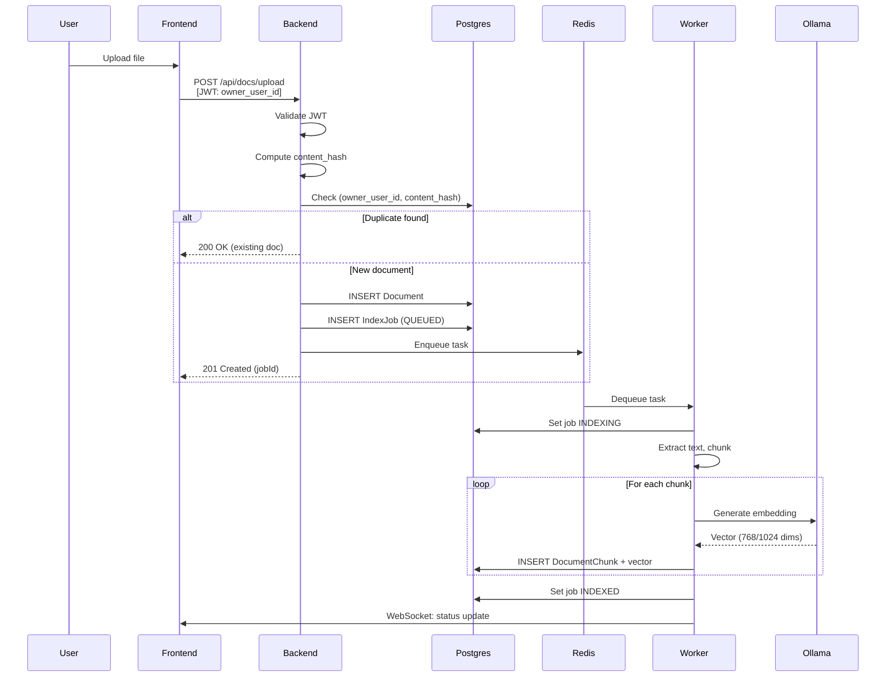
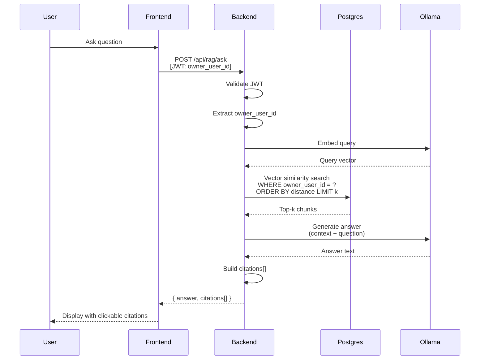
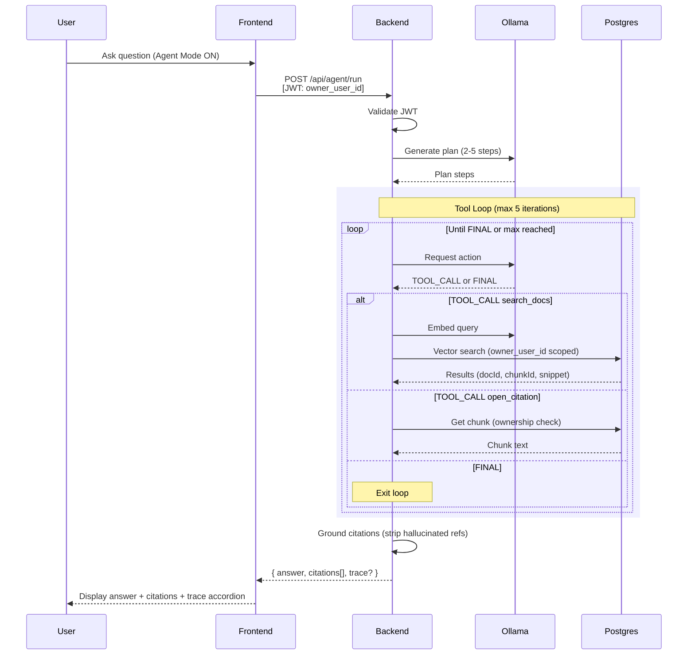

# DocuChat Architecture

This document provides a high-level overview of the DocuChat system architecture.

---

## Table of Contents

1. [System Overview](#system-overview)
2. [Component Diagram](#component-diagram)
3. [Flow Diagrams](#flow-diagrams)
   - [Upload & Index Flow](#upload--index-flow)
   - [Chat/Ask Flow](#chatask-flow)
   - [Agent Run Flow](#agent-run-flow)
4. [Data Model](#data-model)
5. [Security Boundaries](#security-boundaries)

---

## System Overview

DocuChat is a local-first, document-grounded RAG (Retrieval-Augmented Generation) application. All components run in Docker containers on a single host for development and evaluation.

**What runs where (local-only deployment):**

| Container | Role |
|-----------|------|
| `nginx` | Reverse proxy, routes `/` to frontend, `/api` to backend |
| `frontend` | React SPA served via Vite dev server |
| `backend` | Django REST API, handles auth, docs, RAG, agent endpoints |
| `worker` | Celery worker processing async indexing jobs |
| `postgres` | PostgreSQL 16 with pgvector extension for embeddings |
| `redis` | Task queue broker for Celery, caching |
| `keycloak` | Identity provider, issues JWTs via OIDC |
| `ollama` | Local LLM inference (embeddings + chat completions) |

---

## Component Diagram

```
┌─────────────────────────────────────────────────────────────────────────┐
│                              User Browser                                │
└────────────────────────────────────┬────────────────────────────────────┘
                                     │ HTTPS
                                     ▼
┌─────────────────────────────────────────────────────────────────────────┐
│                            NGINX (Reverse Proxy)                         │
│  ┌─────────────────┐                        ┌─────────────────────────┐ │
│  │  /              │ ──────────────────────▶│  Frontend (React SPA)   │ │
│  │  (static/SPA)   │                        │  :5173                  │ │
│  └─────────────────┘                        └─────────────────────────┘ │
│  ┌─────────────────┐                        ┌─────────────────────────┐ │
│  │  /api/*         │ ──────────────────────▶│  Backend (Django)       │ │
│  │                 │                        │  :8000                  │ │
│  └─────────────────┘                        └──────────┬──────────────┘ │
│  ┌─────────────────┐                                   │                │
│  │  /auth/*        │ ──────────────────────▶ Keycloak  │                │
│  └─────────────────┘                         :8080     │                │
└─────────────────────────────────────────────────────────────────────────┘
                                                         │
         ┌───────────────────────────────────────────────┼───────────────┐
         │                                               │               │
         ▼                                               ▼               ▼
┌─────────────────┐   ┌─────────────────┐   ┌─────────────────────────────┐
│     Ollama      │   │      Redis      │   │   PostgreSQL + pgvector     │
│  (LLM + Embed)  │   │  (Task Queue)   │   │   (Docs, Chunks, Vectors)   │
│    :11434       │   │     :6379       │   │         :5432               │
└────────┬────────┘   └────────┬────────┘   └──────────────┬──────────────┘
         │                     │                           │
         │                     ▼                           │
         │            ┌─────────────────┐                  │
         └───────────▶│     Worker      │◀─────────────────┘
                      │  (Celery Async) │
                      │  Indexing Jobs  │
                      └─────────────────┘
```

---

## Flow Diagrams

### Upload & Index Flow



**Auth boundary:** JWT validated at Backend entry. `owner_user_id` extracted from token `sub` claim.

**User scoping:** Documents filtered by `owner_user_id`. Content hash uniqueness is per-user.

---

### Chat/Ask Flow



**Auth boundary:** JWT validated. Only chunks from user's documents are retrieved.

**User scoping:** `WHERE owner_user_id = ?` in vector search ensures isolation.

---

### Agent Run Flow



**Auth boundary:** JWT validated. Tool calls are scoped to user's documents.

**User scoping:** Both `search_docs` and `open_citation` verify `owner_user_id` matches.

**Hard caps:** Max 5 tool calls, 2-5 plan steps, max 1500 chars per citation in context.

---

## Data Model

### Core Tables

```
┌─────────────────────────────────────────────────────────────────────┐
│                           documents                                  │
├─────────────────────────────────────────────────────────────────────┤
│ id              UUID PRIMARY KEY                                    │
│ owner_user_id   VARCHAR(255) NOT NULL   -- Keycloak sub claim       │
│ filename        VARCHAR(255) NOT NULL                               │
│ content_type    VARCHAR(100)                                        │
│ size_bytes      BIGINT                                              │
│ content_hash    VARCHAR(64) NOT NULL    -- SHA-256 hex              │
│ status          VARCHAR(20)             -- UPLOADED/QUEUED/INDEXED  │
│ created_at      TIMESTAMP                                           │
│ updated_at      TIMESTAMP                                           │
├─────────────────────────────────────────────────────────────────────┤
│ UNIQUE(owner_user_id, content_hash)     -- Idempotency constraint   │
└─────────────────────────────────────────────────────────────────────┘

┌─────────────────────────────────────────────────────────────────────┐
│                           index_jobs                                 │
├─────────────────────────────────────────────────────────────────────┤
│ id              UUID PRIMARY KEY                                    │
│ document_id     UUID REFERENCES documents(id)                       │
│ status          VARCHAR(20)             -- QUEUED/INDEXING/INDEXED  │
│ stage           VARCHAR(50)                                         │
│ progress        INTEGER                                             │
│ error_message   TEXT                                                │
│ created_at      TIMESTAMP                                           │
│ updated_at      TIMESTAMP                                           │
└─────────────────────────────────────────────────────────────────────┘

┌─────────────────────────────────────────────────────────────────────┐
│                        document_chunks                               │
├─────────────────────────────────────────────────────────────────────┤
│ id              UUID PRIMARY KEY                                    │
│ document_id     UUID REFERENCES documents(id)                       │
│ chunk_index     INTEGER NOT NULL                                    │
│ text            TEXT NOT NULL                                       │
│ embedding       VECTOR(768)             -- pgvector column          │
│ char_start      INTEGER                                             │
│ char_end        INTEGER                                             │
│ created_at      TIMESTAMP                                           │
├─────────────────────────────────────────────────────────────────────┤
│ UNIQUE(document_id, chunk_index)        -- Idempotent chunking      │
│ INDEX ivfflat(embedding)                -- Vector similarity index  │
└─────────────────────────────────────────────────────────────────────┘
```

### Key Constraints

| Constraint | Purpose |
|------------|---------|
| `UNIQUE(owner_user_id, content_hash)` | Prevents duplicate uploads per user (idempotency) |
| `UNIQUE(document_id, chunk_index)` | Ensures stable chunk IDs for citations |
| `owner_user_id` on all queries | Multi-tenant isolation |

---

## Security Boundaries

### Authentication
- All API endpoints require valid JWT (except `/health/*`)
- JWTs issued by Keycloak, validated via JWKS
- Token contains `sub` claim used as `owner_user_id`

### Authorization
- **Document access:** `owner_user_id` must match token `sub`
- **Chunk access:** Ownership verified via document relationship
- **Agent tools:** Both tools enforce ownership check

### Data Isolation
- No document or chunk query ever omits `owner_user_id` filter
- Vector search includes `WHERE owner_user_id = ?`
- Content hash uniqueness is per-user, not global

### Rate Limiting
- Upload: 5/minute, 50/hour per user
- Ask/Agent: 20/minute per user
- Returns 429 with `Retry-After` header