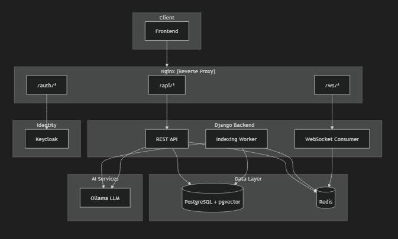
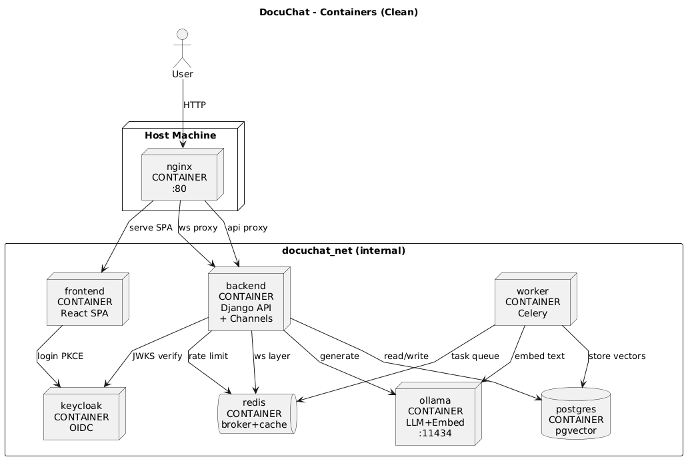
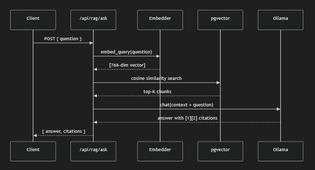
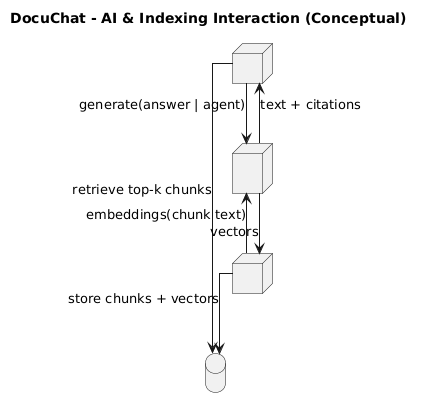
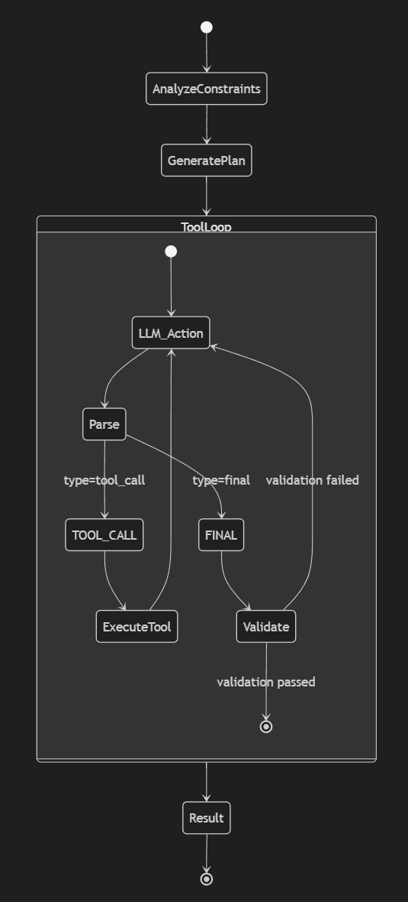
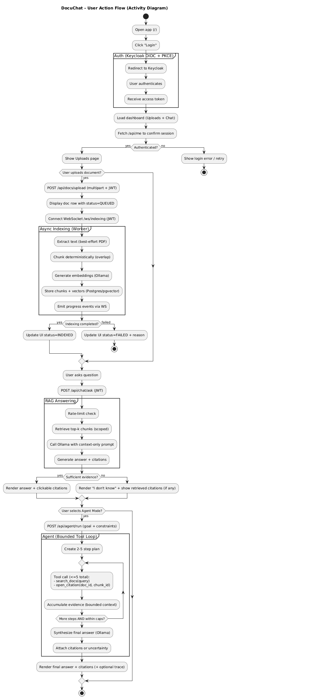
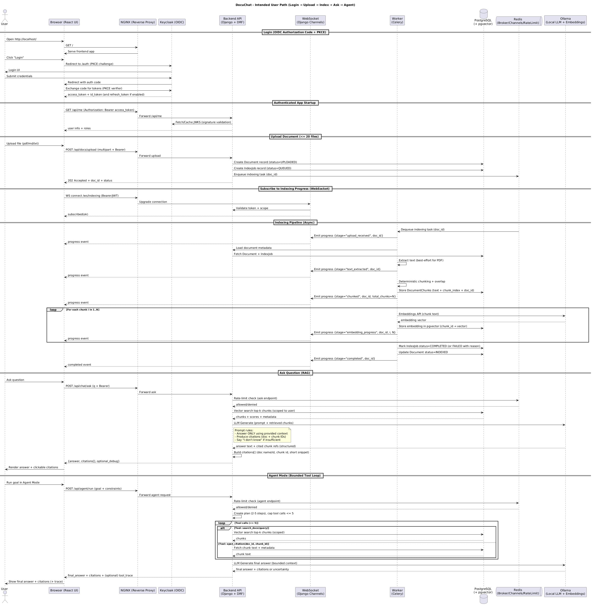

# DocuChat - Local Development Guide

This guide covers how to run DocuChat locally from a clean clone.

---

## System Overview

DocuChat is a local-first, document-grounded RAG (Retrieval-Augmented Generation) application. All components run in Docker containers on a single host.

### High-Level Architecture



### Container Architecture



---

## Prerequisites

- **Docker Desktop** (with Docker Compose v2)
- **Git**
- ~8GB free disk space (for Ollama models)
- ~4GB RAM available for containers

---

## Quick Start

### 1. Clone the Repository

```bash
git clone https://github.com/Atakan-Kaya35/DocuChat.git
cd DocuChat
```

### 2. Set Up Environment Files

Copy sample environment files (no secrets committed):

```bash
# Backend
cp backend/.env.sample backend/.env

# Frontend  
cp frontend/.env.sample frontend/.env

# Infrastructure (Postgres, Keycloak, etc.)
cp infra/.env.sample infra/.env
```

> **Note:** The `.env.sample` files contain working defaults for local development. Review and adjust passwords for production.

### 3. Start All Services

```bash
docker compose up
```

This starts 8 containers:
- `nginx` - Reverse proxy (port 80)
- `frontend` - React app
- `backend` - Django API
- `worker` - Indexing worker
- `postgres` - Database with pgvector
- `redis` - Task queue
- `keycloak` - Identity provider
- `ollama` - Local LLM

**First run takes 10-20 minutes** to pull images and download LLM models (~7GB total for gemma:7b, llama3.2, and nomic-embed-text).

> **Note:** LLM models are downloaded automatically on first run. They are stored in `./infra/ollama/models/` and persist between restarts.

### 4. Access the Application

| URL | Description |
|-----|-------------|
| http://localhost/ | DocuChat frontend |
| http://localhost/auth/ | Keycloak admin console |
| http://localhost/api/healthz | Backend health check |

### 5. Login

Default test user credentials (created by Keycloak realm import):
- **Username:** `testuser`
- **Password:** `testpassword`

Or create a new user via Keycloak admin console:
1. Go to http://localhost/auth/admin
2. Login with `admin` / `admin` (default)
3. Select "docuchat" realm → Users → Add user

---

## Verify Everything Works

### Health Checks

```bash
# Backend health
curl http://localhost/api/healthz

# Readiness (checks all dependencies)  
curl http://localhost/api/readyz
```

### Upload a Document

```bash
# Get a token first
TOKEN=$(curl -s -X POST http://localhost/auth/realms/docuchat/protocol/openid-connect/token \
  -d "grant_type=password" \
  -d "client_id=docuchat-app" \
  -d "username=testuser" \
  -d "password=testpassword" | jq -r '.access_token')

# Upload a file
curl -X POST http://localhost/api/docs/upload \
  -H "Authorization: Bearer $TOKEN" \
  -F "file=@seed_docs/docuchat_runbook.txt"
```

### Ask a Question

```bash
curl -X POST http://localhost/api/rag/ask \
  -H "Authorization: Bearer $TOKEN" \
  -H "Content-Type: application/json" \
  -d '{"question": "How do I reindex a document?"}'
```

---

## How It Works

### RAG (Retrieval-Augmented Generation) Flow

When you ask a question, DocuChat retrieves relevant chunks from your documents and uses them to generate an accurate, grounded answer.



### AI Workflow

The complete AI workflow showing how queries are processed:



### Agent Mode

DocuChat includes an optional Agent mode that can perform multi-step reasoning with tool use:



### Action Flow

How user actions flow through the system:



### Complete Sequence Flow

End-to-end sequence of operations:



---

## Stopping and Cleanup

```bash
# Stop all containers
docker compose down

# Stop and remove volumes (full reset)
docker compose down -v
```

---

## Troubleshooting

### Containers not starting?

```bash
# Check logs
docker compose logs backend
docker compose logs worker
docker compose logs keycloak
```

### Ollama models not loading?

Models are downloaded on first start. Check progress:
```bash
docker logs docuchat-ollama-init
```

### Database issues?

Reset and recreate:
```bash
docker compose down -v
docker compose up
```

---

## Refine Prompt (Query Rewriting)

When enabled via the "Refine" toggle in the chat UI, DocuChat uses an LLM pre-pass to rewrite your question into a more retrieval-friendly form before searching the document index.

### What it does
- Expands abbreviations and clarifies vague terms
- Extracts keywords and named entities
- Generates alternate search queries
- Detects constraints like time ranges or document scope
- The refined query is displayed in your message bubble

### Fallback behavior
If rewriting fails (timeout, parse error, LLM unavailable), the system **silently falls back** to your original question. No user action required.

### Why it's safe
- Feature is **OFF by default**
- Original question is always used for final answer generation
- Only affects the retrieval step
- Can be disabled server-wide via `ENABLE_QUERY_REFINEMENT=false`

---

## Next Steps

- [ARCHITECTURE.md](ARCHITECTURE.md) - System design and data flow
- [API.md](API.md) - Complete API reference
- [OPERATIONS.md](OPERATIONS.md) - Runbooks and operational procedures
- [DECISIONS.md](DECISIONS.md) - Design decisions and trade-offs